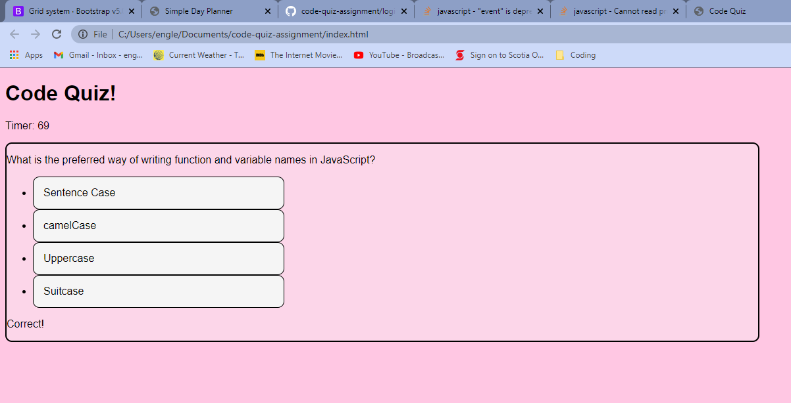

# Code Quiz Assignment

This is a simple quiz built using JavaScript and using DOM elements to set and create various HTML elements.

When you have finished the quiz, you can save and clear your score using local storage.

Please note that I had a very difficult time with this assignment, and I will most likely go back and fix some functions that aren't quite working the way I want them to. I also plan on cleaning up the CSS when I have some time.

